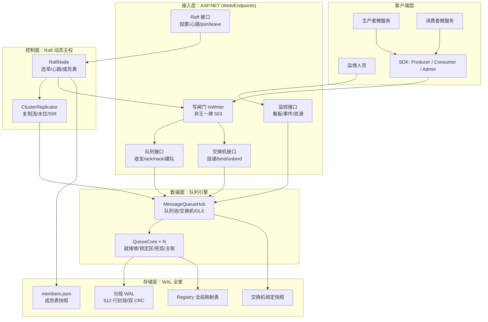
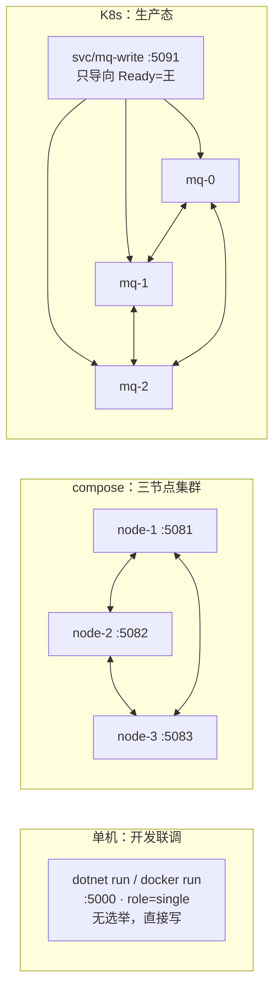
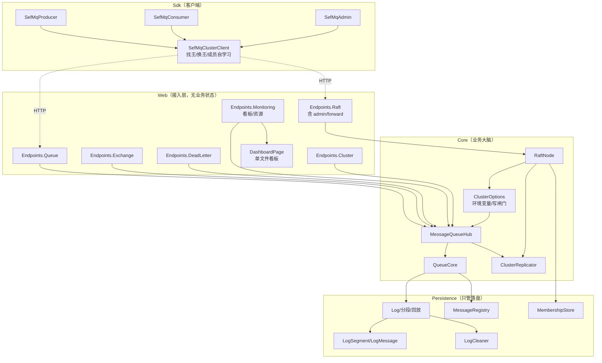
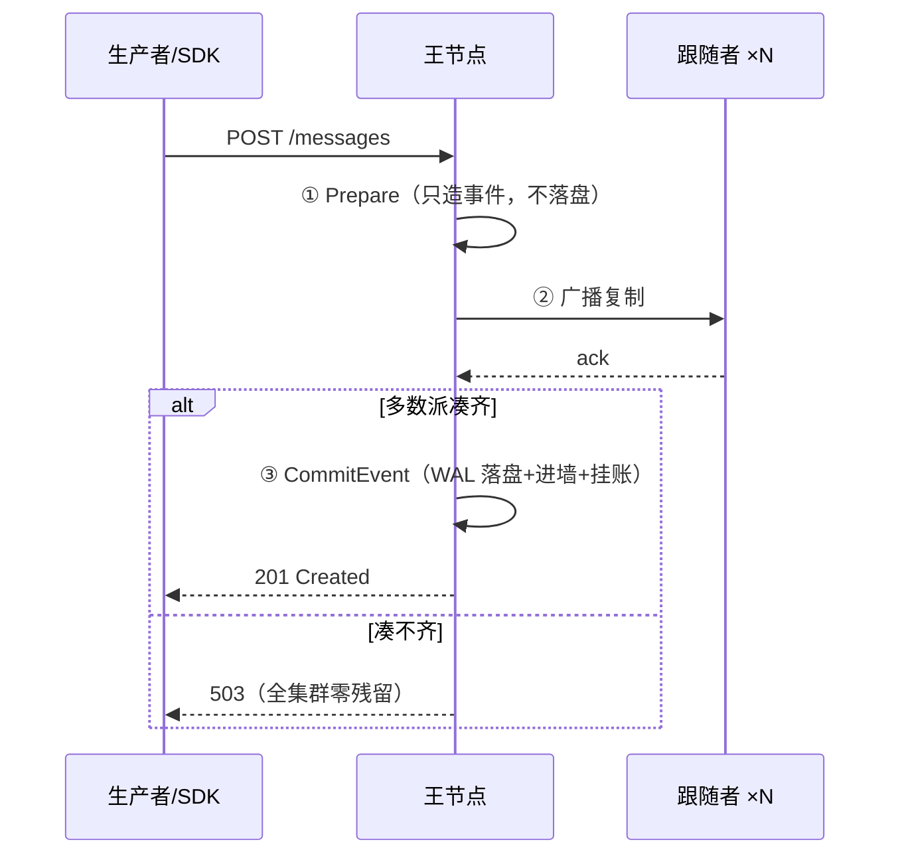
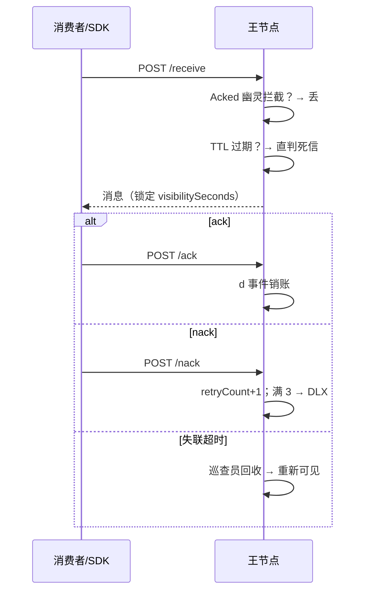
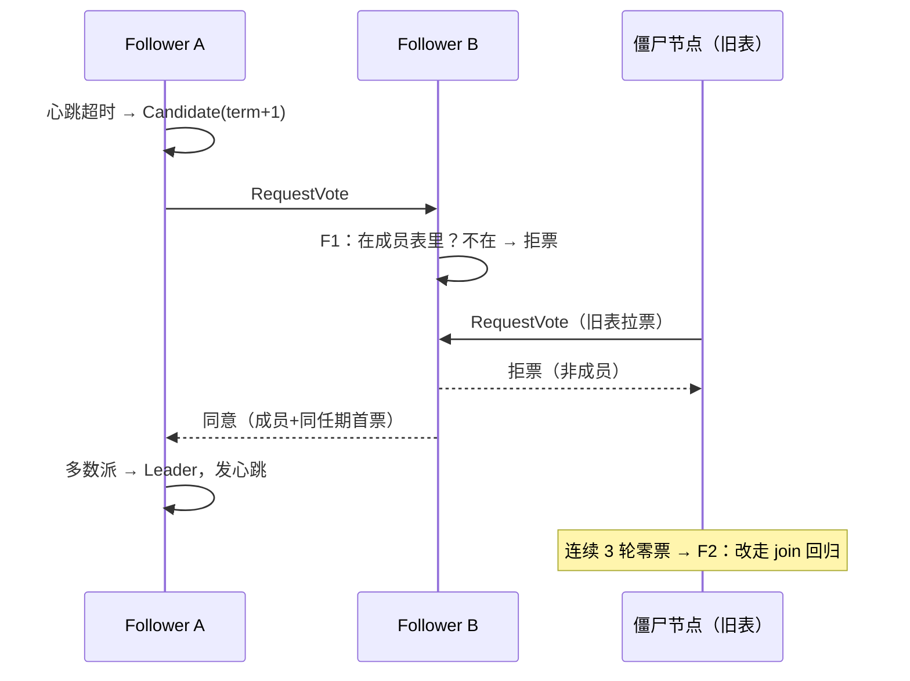
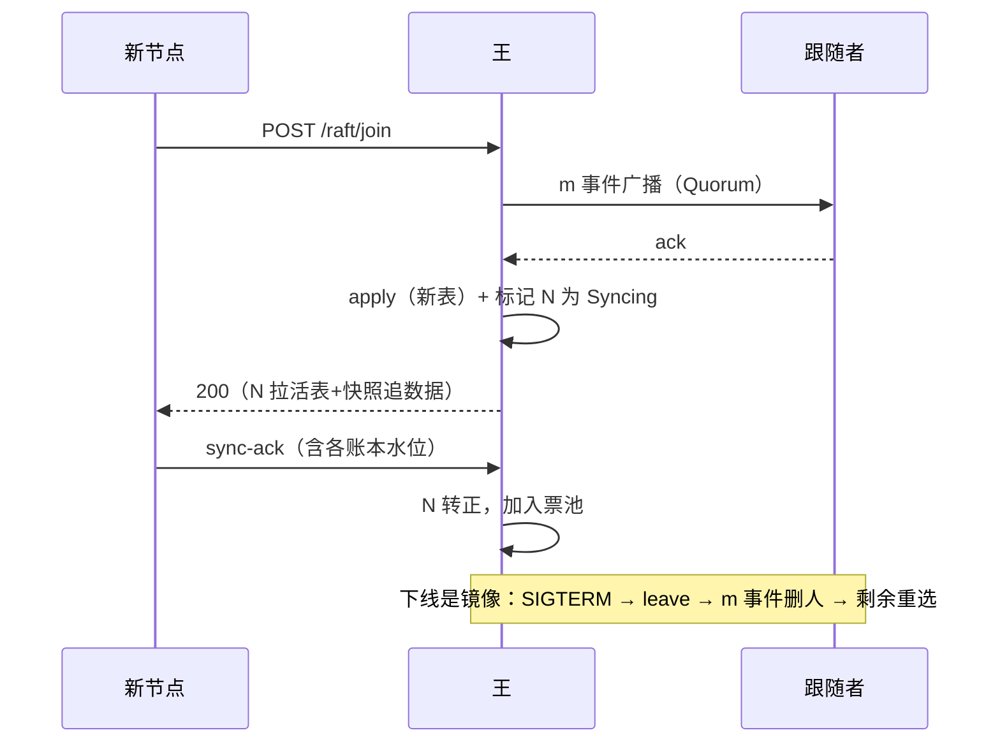
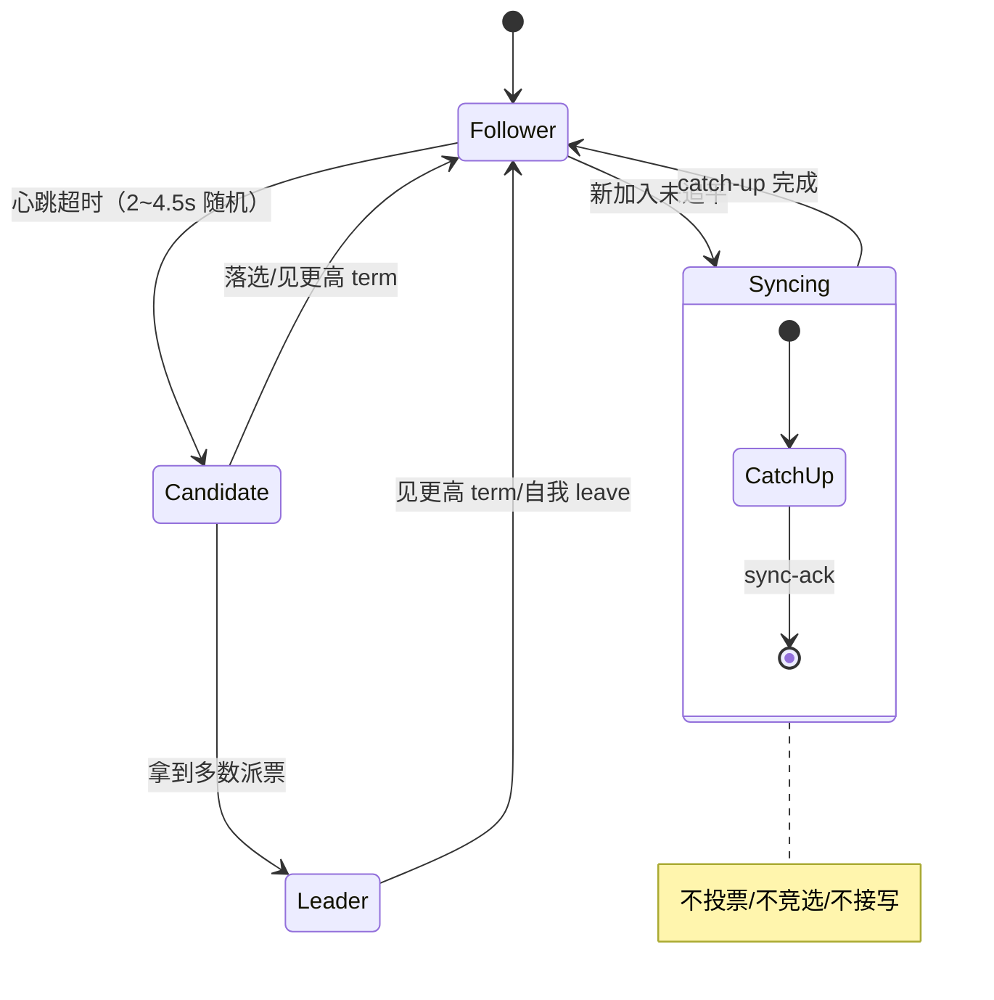
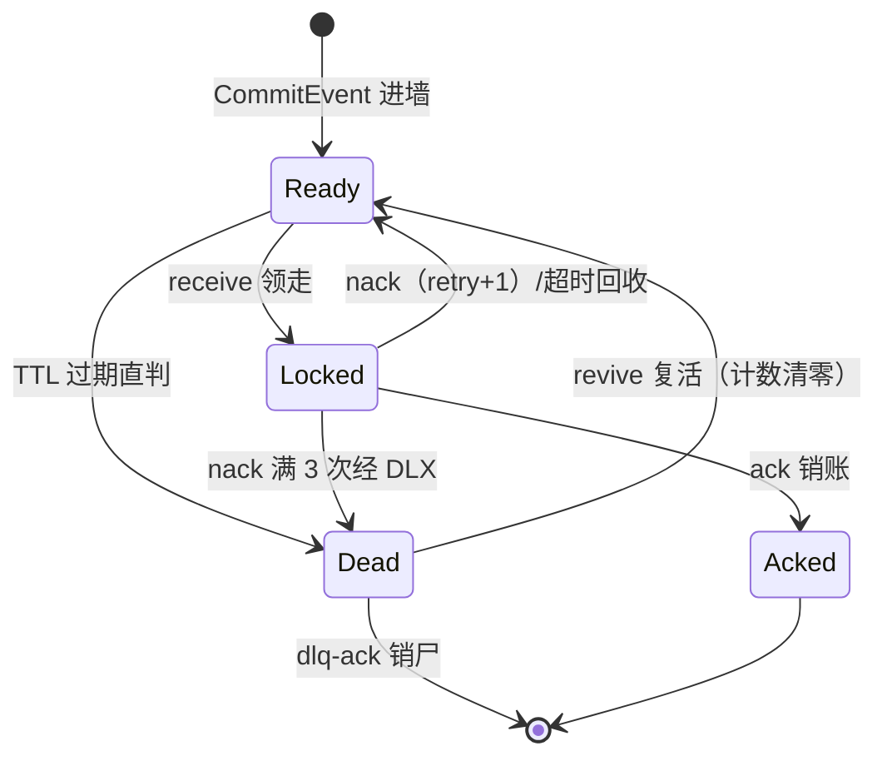

# 自造消息队列 · 产品蓝图（PRODUCT）

> 一句话：微服务之间的轻量通信中间件，不拼吞吐，拼"不丢、看得懂、坏了自己站起来"。
> 读法：本文档从全局到局部——§1 全貌 → §2 部署 → §3 模块依赖 → §4 用例 → §5 流程时序 → §6 状态机 → §7 存储 → §8 接口 → §9 非功能 → §10 术语。细节实现见 `DESIGN.md`，接口参数见 `API.md`，动手运维见 `OPS.md`。

---

## 1. 全貌架构图（一张图看懂产品）



读图三句话：

- **流量只走王**：SDK 自动找王；跟随者收到读写直接 503（纯副本）。
- **控制与数据分离**：Raft 只管"谁是王 + 成员有谁"，队列引擎只管"消息进出"，复制流是两者之间的桥。
- **一切可重启恢复**：WAL、成员表、交换机绑定、Registry 全部落盘，回放重建。

---

## 2. 部署视图（三种形态，同一份代码）



| 形态 | 什么时候用 | 看板地址 | 数据卷 |
|---|---|---|---|
| 单机 | 本地开发、调接口 | `:5000/` | `./data` |
| compose | 集群功能验证、杀王演练 | 任一 `:508x/` | 命名卷（down 保留） |
| K8s | 长期跑、扩缩容、故障自愈 | `:5091/`（经 mq-write） | PVC（缩容自动回收，防僵尸复活） |

> 端口惯例：`mq-N → 5081+N`、`node-N → 5080+N`。看板按成员表自动发现节点，新节点卡片自动出现，掉线自动消失。

---

## 3. 模块依赖关系图（代码地图）



依赖铁律（改代码前先看）：

- `Persistence` 不依赖任何人：纯落盘，可独立单测。
- `Core` 不依赖 `Web`：HTTP 只是皮，换 gRPC 也能接。
- `Web` 无状态：所有判断问 `Hub` / `RaftNode` / `ClusterOptions`，自己不记账。
- `Sdk` 只依赖 HTTP：与服务端版本解耦，换语言重写也行。

## 3.5 类图（完整：仅列关键公开成员，`$` = 静态）

```mermaid
classDiagram
    namespace Core {
        class ClusterOptions {
            +NodeName$ : string
            +SelfUrl$ : string
            +Peers$ : string[]
            +LeaderUrl$ : string
            +Distributed$ : bool
            +IsWriter$ : bool
            +Raft$ : RaftNode
        }
        class RaftNode {
            +Role : RaftRole
            +Synced : bool
            +WriteReady : bool
            +StartAsync() Task
            +HandleVote(candidate, term) RaftVoteResponse
            +ReceiveHeartbeat(leader, term) void
            +JoinMemberAsync(node, url) Task
            +LeaveMemberAsync(node) Task
            +ApplyMembership(seq, table) void
            +MarkSynced(v) void
            +TryRejoinAtBootAsync(url, hub) Task
            +GracefulOfflineAsync() Task
            +PublishTargets() string[]
            +WriteMajority() int
        }
        class MessageQueueHub {
            +DeclareQueue(name) QueueCore
            +Publish(exchange, key, content) int
            +Bind(exchange, pattern, queue) void
            +CaptureSnapshot() ClusterSnapshotBody
            +ApplySnapshot(snap) void
            +ReplicateQueueEventAsync(q, evt) Task
            +ReplayDeltaToFollowerAsync(url) Task
            +SweepAll() int
            +PushEvent(msg) void
        }
        class QueueCore {
            +Send(content, key, ttl) MqMessage
            +CommitEvent(evt) void
            +CommitAck(evt) void
            +PushExternal(evt) void
            +RestoreFromSnapshot(items, upto) void
            +Stats() QueueCoreStats
        }
        class ClusterReplicator {
            +ReplicateAsync(queue, evt) Task
            +SeedWatermark(follower, queue, seq) void
            +IsLagging(follower) bool
        }
        class RaftVoteResponse {
            +Term : long
            +VoteGranted : bool
        }
        class ReplicationResult {
            +AckCount : int
            +Required : int
            +AckedBy : string[]
        }
        class ClusterSnapshotBody {
            +MemberSeq : long
            +Queues : Snapshot[]
        }
        class RaftRole {
            <<enumeration>>
            Follower
            Candidate
            Leader
        }
    }
    namespace Persistence {
        class Log {
            +BuildEvent(type, msg, id) LogMessage
            +CommitEvent(evt) void
            +PushExternal(evt) void
            +Replay() void
            +Snapshot() Message[]
            +ReadEventsFromSeq(seq) Message[]
            +LoadSnapshot(items, upto) void
        }
        class LogSegment {
            +Append(evt) void
            +ReadAll() Message[]
            +MarkSealed() void
            +RewriteInPlace(kept) void
        }
        class LogMessage {
            +Seq : long
            +Ledger : string
            +Type : string
            +Message : MqMessage
            +EncodeLine() string
            +TryDecodeLine(line)$ bool
        }
        class LogCleaner {
            +Compact(dir, log)$ void
        }
        class MessageRegistry {
            +MarkReady(queue, seg, line, msg)$ void
            +MarkInFlight(queue, seg, line, msg)$ void
            +MarkAcked(queue, id)$ void
            +MarkDead(queue, seg, line, msg)$ void
            +TryGet(queue, id)$ Entry
            +EvictStale()$ void
        }
        class RegistryEntry {
            +State : RegistryState
            +Segment : LogSegment
            +LineNo : int
        }
        class RegistryState {
            <<enumeration>>
            Ready
            InFlight
            Acked
            Dead
        }
        class MembershipStore {
            +Table : RaftMember[]
            +Seed(bootstrap) void
            +Contains(node) bool
            +Apply(seq, table) void
            +NextSeq() long
        }
        class RaftMember {
            +Node : string
            +Url : string
        }
        class SegmentState {
            <<enumeration>>
            Active
            Sealed
            Compacted
        }
    }
    namespace Domain {
        class Binding {
            +Pattern : string
            +Queue : string
            +Matches(routingKey) bool
        }
        class ExchangeDef {
            +Name : string
            +Type : string
            +Bindings : Binding[]
        }
        class MqMessage {
            +Id : string
            +Crc : string
            +Key : string
            +Content : string
            +RetryCount : int
        }
        class QueueCoreStats {
            +ReadyInMemory : int
            +LockedInMemory : int
            +PendingOnDisk : int
            +DeadLetters : int
        }
    }
    namespace Sdk {
        class SefMqClusterClient {
            +PostAsync(path, body) Task
            +GetAsync(path) Task
        }
        class SefMqProducer {
            +Send(record, callback) void
            +SendAsync(record) Task
        }
        class SefMqConsumer {
            +BeginConsume(queue, handler) Task
        }
        class SefMqAdmin {
            +QueueStatsAsync() Task
            +DlqListAsync() Task
            +DlqReviveAsync(id) Task
        }
        class SefMqRecord {
            +Topic : string
            +Key : string
            +Value : string
        }
        class SefMqContext {
            +Ack(id) Task
            +Nack(id) Task
        }
    }
    namespace WebApi {
        class QueueEndpoints {
            <<static>>
            +MapQueueApi(app, hub)
        }
        class ExchangeEndpoints {
            <<static>>
            +MapExchangeApi(app, hub)
        }
        class DeadLetterEndpoints {
            <<static>>
            +MapDeadLetterApi(app, hub)
        }
        class ClusterEndpoints {
            <<static>>
            +MapClusterApi(app, hub)
        }
        class RaftEndpoints {
            <<static>>
            +MapRaftApi(app, raft, hub)
        }
        class MonitoringEndpoints {
            <<static>>
            +MapMonitoringApi(app, hub)
            +StartSweeper(app, hub)
        }
        class DashboardPage {
            <<static>>
            +Html$ : string
        }
    }

    MessageQueueHub "1" *-- "N" QueueCore : 队列池
    QueueCore "1" *-- "2" Log : 主账+死信账
    Log "1" *-- "N" LogSegment : 分段
    LogSegment --> LogMessage : 存行
    QueueCore ..> MessageRegistry : 挂账/查重
    MessageRegistry --> RegistryEntry : 索引
    RaftNode "1" *-- "1" MembershipStore : 成员表
    MembershipStore --> RaftMember : 行
    RaftNode --> RaftVoteResponse : 投票结果
    ClusterReplicator --> ReplicationResult : 回执
    ClusterReplicator --> RaftNode : 读王位/票池
    MessageQueueHub --> ClusterReplicator : 复制调度
    MessageQueueHub --> ExchangeDef : 交换机表
    ExchangeDef "1" *-- "N" Binding : 绑定
    QueueCore --> MqMessage : 存取
    QueueCore --> QueueCoreStats : 统计
    LogMessage --> MqMessage : 载荷
    SefMqProducer --> SefMqClusterClient : 经王调用
    SefMqConsumer --> SefMqClusterClient : 经王调用
    SefMqAdmin --> SefMqClusterClient : 经王调用
    SefMqProducer --> SefMqRecord : 发送体
    SefMqConsumer --> SefMqContext : 断案手柄
    SefMqConsumer --> MqMessage : 消费体
    QueueEndpoints --> MessageQueueHub : 收发/建队
    ExchangeEndpoints --> MessageQueueHub : 投递/绑定
    DeadLetterEndpoints --> MessageQueueHub : 死信处置
    ClusterEndpoints --> MessageQueueHub : 复制接收
    RaftEndpoints --> RaftNode : 选主/成员
    MonitoringEndpoints --> DashboardPage : 吐页面
```



读法：先看四个 `*--`（谁拥有谁）：Hub 拥有 N 个 QueueCore、每个 QueueCore 拥有 2 本账（主账+死信）、账由 N 个段组成、交换机由 N 条绑定组成。其余都是"用一下"的虚线依赖。`Program.cs` 不在图中——它只是把这些类 new 出来插在一起的薄启动器。

---

## 4. 用例图（谁用产品做什么）

```mermaid
flowchart LR
    PROD2["🧑‍💻 业务开发"] --> U1(["发送消息（直连/交换机）"])
    PROD2 --> U2(["声明队列/改绑定")]
    PROD2 --> U3(["SDK 接入（自动找王）"])
    CONS2["🔄 消费者服务"] --> U4(["长轮询领取"])
    CONS2 --> U5(["ack 销账 / nack 重试"])
    OPS2["🧭 运维"] --> U6(["看板巡检：队列/资源/事件流"])
    OPS2 --> U7(["死信处置：复活/销尸"])
    OPS2 --> U8(["扩缩容：补 quorum"])
    OPS2 --> U9(["杀王演练/版本滚动"])
    OPS2 --> U10(["排障：成员表/快照/日志"])
    U1 -.经过.-> GATE2(["写闸门")]
    U4 -.经过.-> GATE2
    U7 -.触发.-> DLX2(["DLX 死信交换机"])
    U8 -.触发.-> RAFT2(["成员变更 ±1"])
```

角色×核心用例对照：

| 角色 | 核心用例 | 入口 |
|---|---|---|
| 业务开发 | 发消息、声明队列、改绑定、SDK 接入 | `API.md` §队列/交换机，`Sdk/` |
| 消费者服务 | 领取、ack、nack（满 3 次进死信） | `API.md` §消费 |
| 运维 | 看板巡检、死信处置、补 quorum、滚动升级、排障 | 看板 + `OPS.md` |

---

## 5. 核心流程时序（局部认知：四张图）

### 5.1 写三阶段（Quorum 先复制后落盘）



### 5.2 读与销账（含幂等/TTL 网）



### 5.3 选举与成员自愈（F1/F2 之后）



### 5.4 新节点加入与优雅下线



---

## 6. 状态机（两张图）

### 6.1 Raft 节点三态



### 6.2 单条消息一生



---

## 7. 存储布局（磁盘真相）

```
data/
├── {queue}/                  # 主账本：s000001.jsonl …（满 512 行封段）
│   ├── c2-5.compacted.jsonl  # 压缩产物（只含活账快照）
│   └── s00000N.jsonl         # 活跃段：Append-Only，永不参与压缩
├── {queue}.dlq/              # 死信账本：同款分段 WAL（独立 seq 空间）
├── _exchanges.json           # 交换机绑定快照（bind/unbind 即落盘）
└── _cluster/
    └── members.json          # 成员表快照（join/leave/apply 即落盘）
```

- 每行双 CRC（行级 + 消息级），坏行可定位。
- Registry（id → 状态）是 WAL 回放重建的**索引**，不是第二记账——删了重建即可。
- 快照（snapshot）只用于新节点 catch-up，不做常规持久化。

---

## 8. 接口总览（分组速查，参数见 API.md）

| 分组 | 方法与路径 | 谁调 |
|---|---|---|
| 队列 | `POST /api/q/{q}` 声明 · `POST /api/q/{q}/messages` 发送 · `POST /api/q/{q}/receive` 领取 · `POST /api/q/{q}/ack\|nack/{id}` | SDK/业务 |
| 交换机 | `POST /api/ex/{ex}/publish` 投递 · `POST /api/ex/{ex}/bind\|unbind` 改绑 | 业务 |
| 死信 | `GET /api/q/{q}/dlq` · `POST /api/q/{q}/dlq/{id}/ack\|revive` | 运维 |
| 监控 | `GET /health` · `GET /` 看板 · `GET /api/queues\|events` · `GET /api/cluster/status` · `GET /api/monitoring/resources` | 看板/人 |
| Raft | `POST /api/raft/vote\|heartbeat\|join\|leave` · `POST /api/raft/apply-membership\|sync-ack` · `GET /api/raft/status\|members\|snapshot\|write-ready` | 节点之间 |
| 运维代查 | `POST /api/admin/forward`（王代查成员，Raft 内部协议禁透传） | 看板 |

---

## 9. 非功能与硬约束（诚实清单）

| 项目 | 结论 |
|---|---|
| 定位 | 微服务通信中间件，吞吐量要求不高；优化目标是可用性 |
| 可用性模型 | 3 节点容忍 1 节点故障；死 2 个写瘫（quorum 铁律） |
| RPO / RTO | 已提交写 RPO=0（多数派落盘）；杀王 RTO 秒级（选举 2~4.5s+收敛） |
| 扩缩容口径 | 只看成员健康（存活<3 才补）；**禁 HPA**；日常保持 3，不追 5 |
| 成员上限 | 9（教学版约束，JoinMemberAsync 硬卡） |
| follower 语义 | 纯副本：读写一律 503；资源水位不作为扩缩容依据 |
| 磁盘 | 全节点全量存数据；涨盘扩 volume/清数据，加节点反而更糟 |
| 脑裂防护 | F1 非成员拒票（含 term 压制）+ F2 孤岛回 join + PVC 缩容自动回收 |
| 单测/CI | 24 xunit；push → build+单测+e2e 冒烟；合入 main → 推 GHCR |

---

## 10. 术语表（第一次见的词都在这）

| 词 | 一句话 |
|---|---|
| 王/现王 | Raft Leader，唯一可写节点 |
| Quorum | 多数派；写与成员变更都要过半 |
| WAL | 只追加账本，重启回放恢复 |
| Registry | 全局消息状态映射（回放重建） |
| Syncing | 新节点追数据中：不投票不竞选不接写 |
| DLX | 死信交换机（`dead` topic），`dead.{队列}` 路由 |
| 水位 | follower 已确认到的 Seq，delta 回放起点 |
| ISR/掉队 | 复制跟不上的 follower，巡查员每秒补 |
| 经王转发 | 看板只有一个出口时，由王代查其他成员 |
| 优雅下线 | SIGTERM → leave → 成员表除名 → 退出 |

---

## 11. 文档地图（找不同详细程度）

- 本文档：全局认知（有什么、怎么连、谁调谁）。
- `DESIGN.md`：设计全文（为什么这样定、每次故障的根因复盘）。
- `API.md`：每个接口的参数与返回值。
- `OPS.md`：三形态部署/巡检/扩缩容/排障表（傻子版，可直接复制）。
- `K8S_SCALE.md`：K8s 扩缩容专篇。`ENV.md`：环境变量。`check-mq.ps1`：一键体检脚本。
